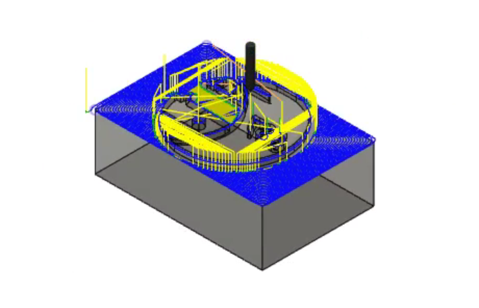

# Nerdy-Stamp

Source code for machining of a rubber stamp with the inprint of the VEX/FRC 687 logo. This project was a part of a hands-on assignment I took while in high school. The logo is used by the FRC/VEX team (687: The Nerd Herd) at my high school.

## Supplies Needed

- A Computer Numerical Control (CNC) Machine
  - For this project, the ___ was used. However, any machine that can hold the stock material is fine.
  - 
